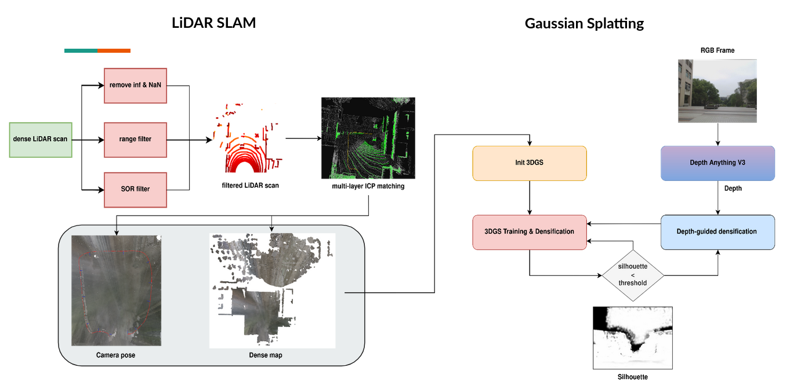

## Pipeline

---

## Demonstration

<video src="./assets/SLAM_3DGS.mp4" controls width="600"></video>

---

## LiDAR SLAM 

input : lidar scan pcd file

output : lidar poses, camera poses, lidar map

steps : 
1. modify ICP.py if you wants different parameters or layers of ICP scan matching
2. modify main.py data IO path (including pre-processing)
3. run main.py -> output lidar pose csv file 
4. cd process
5. python3 camera_pose.py to generate camera pose from lidar pose using SLERP
6. python3 color_mapping_norm.py to generate lidar map
7. python3 filter_pcd.py to remove outlier of map points  (post-processing)

## Result visualization

1. cd  Track folder
2. modify demo.py with different csv file to visualize trajectories

## Kiss-icp

1. pip install kiss-icp
2. pip install "kiss-icp[all]"
3. kiss_icp_pipeline path/to/pcd
4. python3 tf_csv.py -> transform kiss-icp result to csv format

---

## 3DGS

input : RGB images, camera poses, lidar map, depth from depthAnythingV3

output : rendered ply file and visualization of training process

1. modify dataset_reader.py for data Io and parameters
2. modify train.py for training parameters
3. python3 train.py
4. check rendered result in training

---
